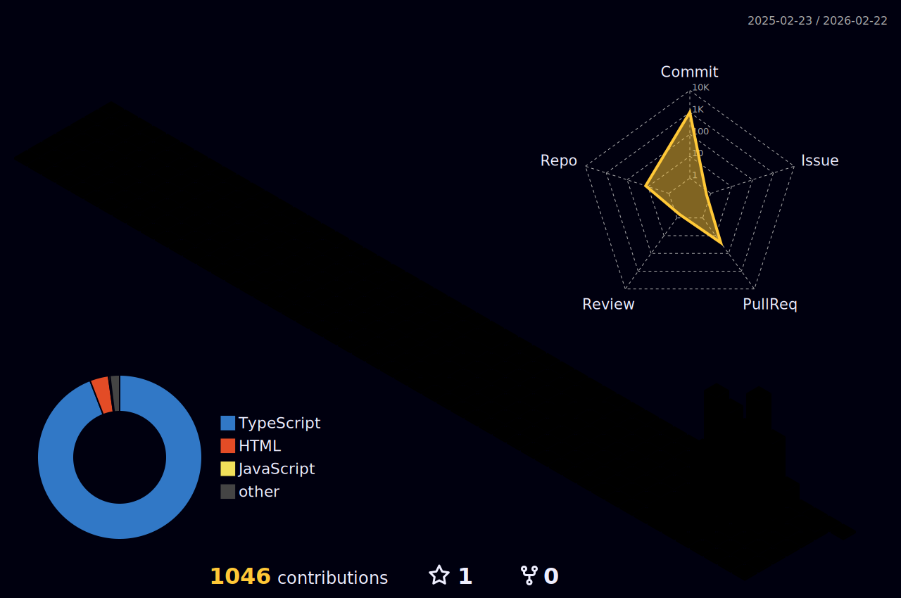

```
 ____    _    ____ _____ _    _   _    ____ ___ _____ ____  ____   ____ _   _
| __ )  / \  / ___|_   _/ \  | \ | |  / ___|_ _| ____|  _ \/ ___| / ___| | | |
|  _ \ / _ \ \___ \ | |/ _ \ |  \| | | |  _ | ||  _| | |_) \___ \| |   | |_| |
| |_) / ___ \ ___) || / ___ \| |\  | | |_| || || |___|  _ < ___) | |___|  _  |
|____/_/   \_\____/ |_/_/   \_\_| \_|  \____|___|_____|_| \_\____/ \____|_| |_|

┌──────────────────────────────────────────────────────────────────────────────┐
│                                                                              │
│  > System:      Intel NUC i7 Cluster (5.0GHz)         Status: OPERATIONAL    │
│  > Hypervisor:  Proxmox VE 8.1 + Docker Swarm         Uptime: 99.9%          │
│  > Network:     10Gbit Infrastructure                 Projects: 5 deployed   │
│  > Location:    Germany                               Role: System Architect │
│                                                                              │
│  > whoami                                                                    │
│  bastian.giersch@agrofert // Fachinformatiker // 18 years old               │
│                                                                              │
│  > cat /etc/skills                                                           │
│  [FULL_STACK_DEV] [DEVOPS] [INFRASTRUCTURE] [AI_INTEGRATION]                │
│                                                                              │
└──────────────────────────────────────────────────────────────────────────────┘
```

<div align="center">

[](https://github.com/bast1qn)
[](https://github.com/bast1qn?tab=followers)
[](https://github.com/bast1qn)

<br>

<a href="https://bastian-giersch.de">
  
</a>
<a href="mailto:contact@bastian-giersch.de">
  
</a>
<a href="https://ragepvp.de">
  
</a>

</div>

<br>

<div align="center">
  
</div>

<br>

##  METRICS & ACTIVITY

<div align="center">

<!-- Main Metrics Card - Generated by lowlighter/metrics -->
<picture>
  <source media="(prefers-color-scheme: dark)" srcset="https://raw.githubusercontent.com/bast1qn/bast1qn/main/metrics.svg">
  
</picture>

<br><br>

<!-- Isometric Calendar - Generated by lowlighter/metrics -->
<picture>
  <source media="(prefers-color-scheme: dark)" srcset="https://raw.githubusercontent.com/bast1qn/bast1qn/main/metrics-isocalendar.svg">
  
</picture>

<br><br>

<!-- Coding Habits - Generated by lowlighter/metrics -->
<picture>
  <source media="(prefers-color-scheme: dark)" srcset="https://raw.githubusercontent.com/bast1qn/bast1qn/main/metrics-habits.svg">
  
</picture>

</div>

<br>

<div align="center">
  
</div>

<br>

##  TECH STACK

<div align="center">

### Languages & Frameworks


### Infrastructure & DevOps


### Databases & Tools


</div>

<br>

<div align="center">
  
</div>

<br>

##  FEATURED PROJECTS

<div align="center">

| Project | Description | Tech | Status |
|:-------:|:------------|:----:|:------:|
| **[RAGE PVP](https://ragepvp.de)** | High-Performance Minecraft Network with 500+ concurrent players, real-time stats, ELO ranking system, and automated CI/CD |     |  |
| **NEXUS** | Military-grade DevOps platform with real-time monitoring, LAN scanner, vulnerability detection, and multi-server orchestration |    |  |
| **LOTION** | Notion-inspired collaborative editor with TipTap, 50+ language syntax highlighting, drag & drop blocks, and real-time sync |    |  |
| **SCALESITE AI** | AI automation platform powered by Google Gemini 1.5 Pro with 128k context, multimodal generation, and 15+ language code gen |    |  |
| **WITTENBERG** | High-performance web app with 95+ Lighthouse score, 60 FPS animations, mobile-first design, and <2s TTI |    |  |

</div>

<br>

<div align="center">
  
</div>

<br>

##  3D CONTRIBUTION GRAPH

<div align="center">

<!-- 3D Contribution Graph - Generated by yoshi389111/github-profile-3d-contrib -->
<picture>
  <source media="(prefers-color-scheme: dark)" srcset="./profile-3d-contrib/profile-night-rainbow.svg">
  <source media="(prefers-color-scheme: light)" srcset="./profile-3d-contrib/profile-south-season-animate.svg">
  
</picture>

</div>

<br>

<div align="center">
  
</div>

<br>

##  GITHUB STATS

<div align="center">


<br><br>


</div>

<br>

<div align="center">
  
</div>

<br>

##  CONTRIBUTION SNAKE

<div align="center">

<!-- Snake Animation - Generated by Platane/snk -->
<picture>
  <source media="(prefers-color-scheme: dark)" srcset="https://raw.githubusercontent.com/bast1qn/bast1qn/output/github-contribution-grid-snake-dark.svg">
  <source media="(prefers-color-scheme: light)" srcset="https://raw.githubusercontent.com/bast1qn/bast1qn/output/github-contribution-grid-snake-dark.svg">
  
</picture>

</div>

<br>

<div align="center">
  
</div>

<br>

##  CONNECT

<div align="center">

```
┌──────────────────────────────────────────────────────────────────────────────┐
│                                                                              │
│   > ssh bast1qn@bastian-giersch.de                                          │
│   Connection established...                                                  │
│                                                                              │
│   Available endpoints:                                                       │
│   ├── https://bastian-giersch.de      [Portfolio]                           │
│   ├── https://ragepvp.de              [Minecraft Server]                    │
│   └── contact@bastian-giersch.de      [Email]                               │
│                                                                              │
│   "Building the infrastructure of tomorrow, today."                          │
│                                                                              │
└──────────────────────────────────────────────────────────────────────────────┘
```

<br>

[](https://bastian-giersch.de)
[](https://ragepvp.de)
[](mailto:contact@bastian-giersch.de)

<br>


<br>

**Built with** 💙 **by Bastian Giersch**

*© 2025 • Powered by Intel NUC Cluster • 99.9% Uptime*

<br>


</div>
